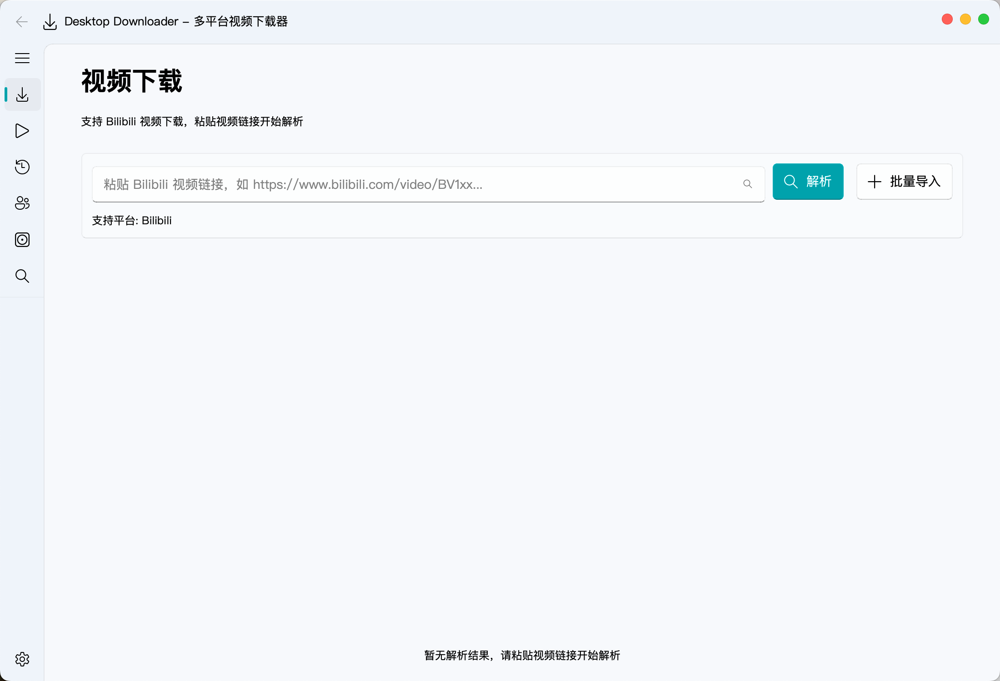
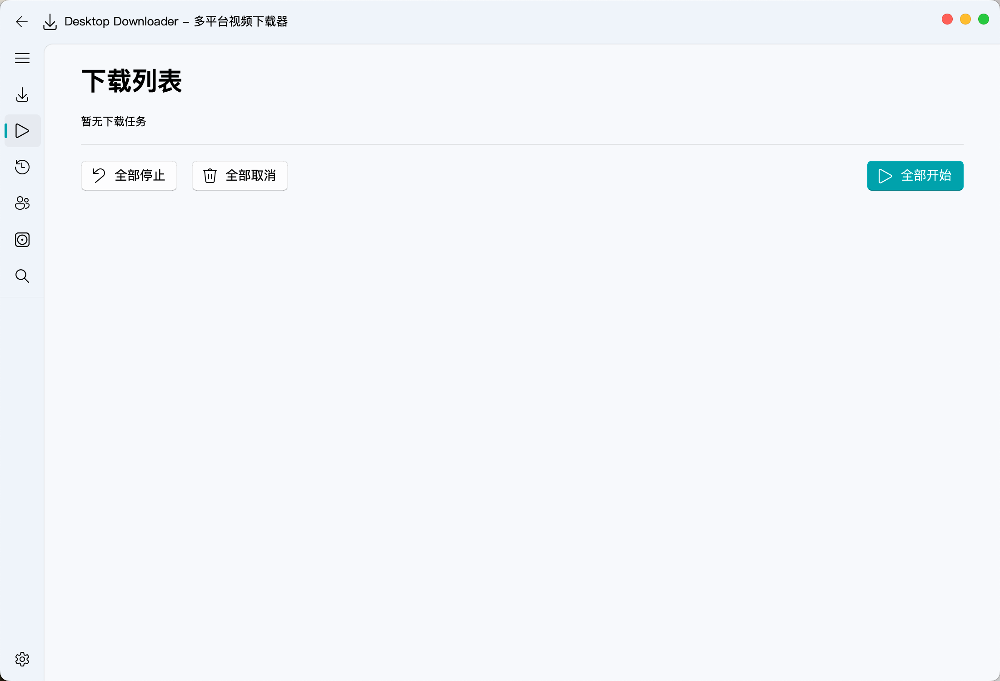
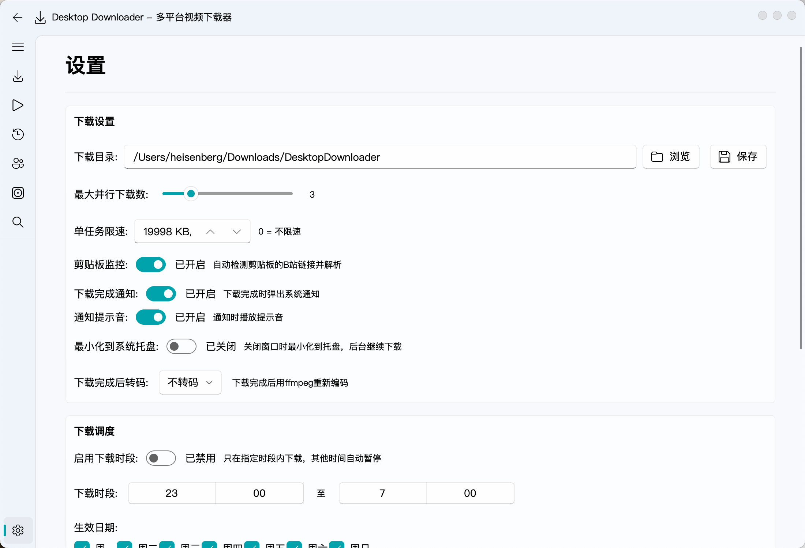

# Desktop Downloader

多平台视频下载器，支持 **Bilibili** 视频、UP 主空间、UP 主合集/列表的批量解析与下载。基于 PySide6 + qfluentwidgets 构建，拥有现代化的 Fluent Design 界面。

## 功能

- **视频解析** — 粘贴链接一键解析，自动获取画质、大小、时长等信息
- **多 P 下载** — 支持选择多 P 视频的指定分 P 下载
- **批量解析** — 支持 UP 主空间和合集页的批量解析，以卡片形式展示所有视频
- **下载管理** — 支持多任务并行下载、暂停/继续、速度限制、等待队列
- **下载列表** — 区分「正在下载」和「等待下载」，一键全部暂停/取消/开始
- **剪贴板监控** — 自动检测剪贴板中的视频链接并跳转
- **登录集成** — 支持 Bilibili 扫码登录以获取更高的下载画质
- **下载历史** — 记录所有已完成下载，支持重新下载和打开所在目录
- **主题切换** — 支持浅色/深色/跟随系统主题
- **FFmpeg 合并** — 自动合并音视频流，内置 FFmpeg

## 截图


*主页 — 视频解析与下载入口*


*下载列表 — 管理所有下载任务*


*设置 — 自定义下载路径、并发数、速度限制等*

## 快速开始

### 前置依赖

- Python 3.10+
- [FFmpeg](https://ffmpeg.org/)（已包含在 `bin/` 目录中）

### 安装

```bash
git clone https://github.com/SuiYueMengHen/desktop-downloader.git
cd desktop-downloader
pip install -r requirements.txt
python main.py
```

### 打包为独立应用

```bash
pip install pyinstaller
./build.sh            # 构建当前版本
./build.sh bump       # 自动递增 patch 版本号后构建
./build.sh bump-minor # 自动递增 minor 版本号后构建
```

构建产物位于 `dist/` 目录：
- `dist/Desktop Downloader.app` — 独立应用
- `dist/Desktop Downloader-{version}.dmg` — 安装包（拖入 Applications 即可）

`build.sh` 自动执行：版本号递增 → PyInstaller 构建 → 清除无用框架（Qt/PIL/lxml）→ 重签名 → 创建 DMG。

## 使用说明

1. 启动应用后，在主页输入框粘贴 Bilibili 视频/UP 主/合集链接，点击「解析」
2. 解析完成后选择画质和分 P（如有），点击「下载」
3. 切换到「下载列表」查看下载进度
4. 在「设置」中可调整下载路径、并发数、速度限制和剪贴板监控

## 技术栈

| 类别       | 技术                                     |
| ---------- | ---------------------------------------- |
| GUI 框架   | PySide6 (Qt for Python)                  |
| UI 组件库  | qfluentwidgets (Fluent Design)           |
| 视频解析   | bilibili-api-python, yt-dlp              |
| 网络请求   | httpx                                    |
| 音视频合并 | FFmpeg                                   |
| 打包工具   | PyInstaller                              |

## 项目结构

```
desktop-downloader/
├── app/
│   ├── __init__.py          # 版本号
│   ├── main_window.py       # 主窗口 + 导航
│   ├── config.py            # 配置管理
│   ├── download_manager.py  # 下载管理器
│   ├── clipboard_monitor.py # 剪贴板监控
│   ├── cookie_manager.py    # Cookie / 登录管理
│   ├── history_manager.py   # 下载历史记录
│   ├── notification.py      # 系统通知
│   ├── theme.py             # 主题感知样式系统
│   ├── update_checker.py    # 自动更新检查
│   ├── platforms/           # 平台解析器（bilibili 等）
│   ├── ui/                  # UI 页面
│   │   ├── home_page.py
│   │   ├── download_page.py
│   │   ├── settings_page.py
│   │   ├── history_page.py
│   │   ├── up_page.py
│   │   ├── collection_page.py
│   │   ├── login_dialog.py
│   │   └── styles.py
│   └── utils/               # 工具函数
├── bin/
│   └── ffmpeg               # 内置 FFmpeg
├── main.py                  # 入口
├── build.sh                 # 构建脚本
├── post_process.sh          # 构建后处理（清理 + 签名）
├── requirements.txt
└── Desktop Downloader.spec  # PyInstaller 打包配置
```

## 更新记录

### v1.0.4 (2026-06-26)

**稳定性**
- 🛡️ 全局异常兜底 — `sys.excepthook` 写入日志文件 `~/.desktop-downloader/app.log`
- 🛡️ 配置校验 — 损坏配置自动重置为默认值
- 🛡️ 资源泄漏修复 — `stop_all()` 非阻塞，共享 3s  deadline 并行 wait
- 🛡️ 启动崩溃恢复 — `.running` 标记 + InfoBar 提示
- 🛡️ WorkerMixin 清理 — 移除死代码分支 `_submit_next_batch`

**UI/UX**
- 🎨 空状态缺省页 — 历史/下载/首页统一样式（IconWidget + 标题）
- 🎨 暗色模式打磨 — 所有文字颜色通过 `app/theme.py` 统一管理，主题切换自动适配
- 🎨 操作反馈增强 — 通知可点击（点击跳转下载页）
- 🎨 设置页搜索栏 — `SearchLineEdit` 过滤设置卡片
- 🎨 统计看板 — 历史页顶部显示文件总数/总大小/平台分布/平均大小

**历史管理**
- 📁 CSV/JSON 导出 — 批量导出历史记录
- 📁 批量删除 — 多选后一键删除
- 📁 搜索过滤 — 实时搜索历史条目

**构建**
- 📦 `build.sh` — 全自动构建脚本（版本自增 → PyInstaller → 清理 → 签名 → DMG）
- 📦 `update_checker.py` — 启动时后台检查 GitHub Releases 新版本
- 📦 DMG 安装包 — 拖入 Applications 即可安装

**修复**
- 🐞 暗色模式开屏图标/文字颜色 — `SplashOverlay` 在主题应用后刷新图标与文字色
- 🐞 `WorkerMixin._safe_reset()` 崩溃 — CoverLoader (QRunnable) 误入 `_workers` 列表后 `isRunning()` 触发 `AttributeError`
- 🐞 `home_page._clear_results()` 线程分类 — CoverLoader 转入 `_cover_loaders` 而非 `_workers`
- 🐞 UP 主搜索跳转主页解析失败 — `_safe_reset()` 中 CoverLoader 导致解析中断

### v1.0.2-alpha.2 (2026-06-24)

**新增**
- ✨ 启动动画 — FluentUI 风格启动闪屏，支持亮色/暗色模式，可在设置中关闭
- ✨ 批量导入对话框全新设计 — URL 计数徽章、一键粘贴/清空/去重、实时计数

**优化**
- ⚡ 性能优化 — `setUpdatesEnabled(False)` 包裹批量清除操作，消除闪烁
- ⚡ 设置页主题切换 — 使用 `setTheme(lazy=True)`，切换瞬间完成
- ⚡ ProgressRing 定时器 50ms → 33ms（60fps 流畅旋转）
- 🎨 批量结果卡片 — 完整标题工具提示、横向分 P 选择器
- 🎨 下载历史 — 合集卡片重新设计：剧集计数徽章、更大操作按钮
- 🎨 搜索/UP 主空间 — 截断标题添加工具提示
- 🎨 设置页外观 — 新增「启动动画」开关
- 🎨 关于页 — Splash 版本号同步更新

### v1.0.2-alpha.1 (2026-06-23)

**架构重构**
- 🔧 WorkerMixin 生命周期管理 — `_safe_reset()` 统一清理线程
- 🔧 集中式路由 — `request_parse()` 统一处理所有 URL 请求
- 🔧 批量模式修复 — `_exit_batch_mode()` 释放锁，`request_parse()` 拒绝并发
- 🔧 macOS 触控板滚动 — 跳过 SmoothScrollArea，使用 Qt 原生滚轮

**新功能**
- ✨ 下载调度 — 设置页新增下载时段/日期/限速计划
- ✨ 剪贴板智能路由 — UP 主空间/合集/视频自动跳转对应页面
- ✨ 凭证周期性刷新 — 每 30 分钟 + 启动 5 秒后后台校验

**修复**
- 🐞 快速切换解析链接不再显示过期结果（generation counter）
- 🐞 批量模式下按 Esc 正确取消
- 🐞 多线程 `QThread` 析构竞争条件 — 安全转移 Worker 引用

### v1.0.1-alpha.1 (2026-06-22)

- 初始版本发布
- Bilibili 视频解析与下载
- 多 P 选择、批量导入
- UP 主空间与合集浏览
- 下载管理、历史记录
- 扫码登录与画质选择
- Fluent Design 界面

## 许可证

[MIT](LICENSE)
